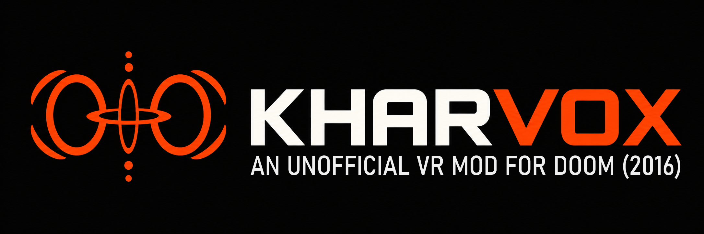

# KHARVOX Intro



A tiny standalone VR intro extracted from KHARVOX, featuring animated particle shapes, copper-colored text and MOD music. Native C++ with OpenXR, available for Windows PC VR and Meta Quest standalone.

## Build prerequisites

Build on Windows with PowerShell 7.2+, CMake 3.24+ on PATH, and Visual Studio with the **Desktop development with C++** workload and Windows SDK. Run the commands below from the repository root. Both scripts download and cache a pinned OpenXR SDK on the first build.

## Windows PC VR

```powershell
.\build-release.ps1
```

Builds, runs the tests and creates `Release/KHARVOX Intro.exe`. Assets and the OpenXR loader are embedded in this single executable. Running it requires a connected VR headset and an active OpenXR runtime.

## Meta Quest

Also requires Android SDK Platform 34, Android Build Tools, an Android NDK, JDK 17 and Ninja. Tested with Build Tools 36 and NDK r27c. The script can automatically use Android tools installed with Unity Hub; the intro itself does not use Unity.

```powershell
.\build-quest.ps1
```

For a separate Android toolchain, supply all three paths:

```powershell
.\build-quest.ps1 -Sdk "C:\Android\Sdk" -Ndk "C:\Android\Sdk\ndk\27.2.12479018" -JavaHome "C:\Java\jdk-17"
```

Creates `Release/Quest/KHARVOX Intro.apk` for ARM64, with package ID `com.cactusVRstudios.KharvoxIntro`. The APK is signed with a local sideload key stored in `.local/quest-sideload.keystore`; keep that key for future updates.

Install on a Quest with developer mode and USB debugging enabled:

```powershell
adb install -r "Release/Quest/KHARVOX Intro.apk"
```
